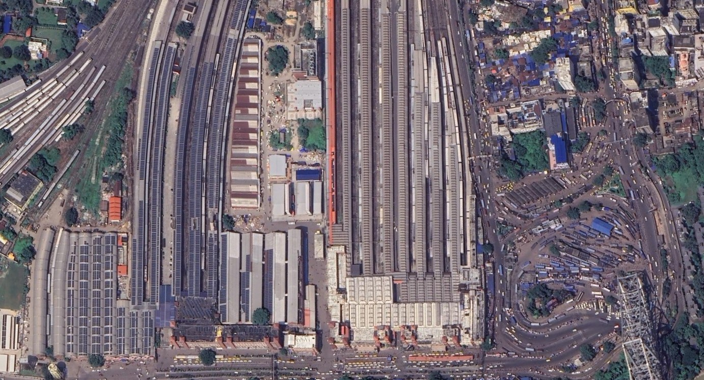

<p align="center">
  
</p>

<h1 align="center">🚂 Rails of India</h1>

<p align="center">
  <b>The most authentic Indian railway simulation ever built.</b><br>
  Real routes. Real stations. Real signals. Open source. Forever free.
</p>

<p align="center">
  <a href="#-download"></a>
  <a href="#"></a>
  <a href="#"></a>
  <a href="#"></a>
</p>

---

## 🎯 What is Rails of India?

**Rails of India** is a 1:1 scale Indian railway simulator built on the [Stride Engine](https://www.stride3d.net/) (v4.3). We're recreating the entire Indian rail network — 68,000+ km of track, 7,000+ stations — with accurate GIS data, authentic signaling, and detailed station models.

Starting with **Mumbai's suburban locals** and expanding outward to iconic services like **Rajdhani**, **Shatabdi**, and **Vande Bharat** expresses.

> 🛤️ Every curve, bridge, junction, and signal is true to life.

---

## ✨ Features

| Feature | Description |
|---------|-------------|
| 🗺️ **Real Routes** | Accurate GIS data — every curve, bridge, and junction is true to life |
| 🚦 **Authentic Signals** | Indian signaling systems — semaphore, color light, automatic block |
| 🏛️ **Detailed Stations** | Howrah, CST Mumbai, New Delhi — modeled with precision |
| 👥 **Multiplayer** | Drive with friends or manage entire divisions cooperatively |
| 🧩 **Mod Support** | Full modding API for custom rolling stock, routes, and liveries |
| 💻 **Open Source** | Built by the community, for the community |

---

## 📥 Download

> ⚠️ **v0.1 Alpha** — Windows 10/11 · ~2.5 GB

### How the patch system works

Rails of India uses a custom patching system to keep downloads small and modular:

```
1. Download the CORE game (required for first-time players)
2. Apply MINOR PATCHES (.roimip) one by one, in order
3. OR grab a MAJOR PATCH (.roimap) that bundles multiple minor patches
```

**Example:** A file named `MAP_HWH-NDLS_Route(12-25).roimap` bundles minor patches 12 through 25. After applying it, only download minor patches numbered 26+.

| Type | Extension | Description |
|------|-----------|-------------|
| **Core** | — | Base game, required for all players |
| **Minor Patch** | `.roimip` | Incremental updates, apply in order |
| **Major Patch** | `.roimap` | Bundled updates, includes multiple minor patches |
| **Grand Patch** | — | Full milestone releases |

👉 Visit the [Download Page](download.html) for all available files.

---

## 🏗️ Tech Stack

| Component | Technology |
|-----------|------------|
| **Game Engine** | [Stride 4.3](https://www.stride3d.net/) (.NET / C#) |
| **Website** | Vanilla HTML + CSS + JS |
| **Auth** | Firebase Authentication (Google sign-in) |
| **Font** | [Inter](https://fonts.google.com/specimen/Inter) (Google Fonts) |
| **Hosting** | GitHub Pages (or any static host) |

---

## 📁 Project Structure

```
rails-of-india/
├── index.html          # Homepage — hero, features, about, download CTA
├── download.html       # Download page — patch system explained + download cards
├── style.css           # Shared stylesheet (dark theme, gold accents)
├── fireauth.js         # Firebase Authentication (Google sign-in)
├── Images/
│   └── Howrah_Birdseye.jpg   # Hero background image
└── game/
    └── openme.txt      # Placeholder for game files
```

---

## 🌐 Website Pages

### `index.html` — Homepage
- Cinematic full-viewport hero with Howrah bird's eye image
- 6-card feature grid
- Vision / About section
- Download CTA with action buttons
- Firebase auth (Sign In / Log Out)

### `download.html` — Downloads
- Short hero page header
- Step-by-step patching instructions (numbered cards)
- Download cards for Core, Minor, Major, and Grand patches
- Same nav, footer, and auth flow as homepage

---

## 🔐 Authentication

The site uses **Firebase Authentication** with Google sign-in via `fireauth.js`.

Three HTML elements are used across all pages:

```html
<span id="user-name"></span>          <!-- Shows logged-in user's name -->
<button id="login-btn">Sign In</button>   <!-- Visible when logged out -->
<button id="logout-btn">Log Out</button>  <!-- Visible when logged in -->
```

Your `fireauth.js` script should toggle visibility of these elements based on auth state.

---

## 🎨 Design System

The site follows a consistent dark cinematic theme:

| Token | Value | Usage |
|-------|-------|-------|
| **Background** | `#0b0d10` | Page background |
| **Gold Accent** | `#f59e0b` | Logo, labels, buttons, highlights |
| **Gold Gradient** | `#fbbf24 → #f59e0b` | Primary CTA buttons |
| **Text Primary** | `#ffffff` | Headings |
| **Text Muted** | `rgba(255,255,255,0.4)` | Body text, descriptions |
| **Card BG** | `rgba(255,255,255,0.03)` | Feature & download cards |
| **Card Border** | `rgba(255,255,255,0.06)` | Subtle card outlines |
| **Font** | Inter (400, 600, 800, 900) | All text |

### CSS Classes Cheatsheet

| Class | What it does |
|-------|-------------|
| `.btn .btn-gold` | Gold gradient CTA button |
| `.btn .btn-ghost` | Transparent outlined button |
| `.btn-sm` | Small nav button |
| `.btn-disabled` | Grayed out, non-clickable |
| `.feat` | Feature card |
| `.dl-card` | Download card |
| `.step` + `.step-num` | Numbered instruction step |
| `.label` | Gold uppercase section label |
| `.heading` | Section heading |
| `.r` | Scroll-reveal element (add `.v` to show) |
| `.hero-short` | 50vh hero for sub-pages |

---

## 🚀 Getting Started (Development)

1. **Clone the repo**
   ```bash
   git clone https://github.com/YOUR_USERNAME/rails-of-india.git
   cd rails-of-india
   ```

2. **Add your Firebase config**
   
   Create/update `fireauth.js` with your Firebase project credentials.

3. **Add your images**
   
   Place your images in the `Images/` folder:
   - `Howrah_Birdseye.jpg` — Hero background

4. **Serve locally**
   ```bash
   # Any static server works:
   npx serve .
   # or
   python -m http.server 8000
   # or just open index.html in your browser
   ```

5. **Deploy**
   
   Push to GitHub and enable **GitHub Pages** from Settings → Pages → Deploy from `main` branch.

---

## 🤝 Contributing

We'd love your help! Here's how:

1. **Fork** this repo
2. **Create a branch** — `git checkout -b feature/amazing-feature`
3. **Commit** — `git commit -m "Add amazing feature"`
4. **Push** — `git push origin feature/amazing-feature`
5. **Open a Pull Request**

### Areas we need help with:
- 🗺️ **Route data** — GIS coordinates for Indian rail routes
- 🚃 **3D Models** — Rolling stock, stations, infrastructure
- 🎮 **Stride scripting** — Game logic, UI controllers, multiplayer
- 🎨 **Website** — New pages (community, mods, contributions)
- 📝 **Documentation** — Guides, tutorials, API docs
- 🌐 **Translations** — Hindi, Tamil, Bengali, and more

---

## 📋 Roadmap

- [x] Website — Homepage & Download page
- [x] Firebase Authentication
- [x] Custom patch system design (`.roimip` / `.roimap`)
- [ ] Game Core v0.1 Alpha release
- [ ] Mumbai Suburban route (first playable route)
- [ ] Howrah Junction station model
- [ ] Basic signaling system
- [ ] Multiplayer prototype
- [ ] Modding API v1
- [ ] Rajdhani Express route (Delhi → Howrah)
- [ ] Community hub & mod repository

---

## 📜 License

This project is open source under the **MIT License**. See [LICENSE](LICENSE) for details.

---

## 💬 Community

<p align="center">
  <a href="#">🌐 Website</a> &nbsp;·&nbsp;
  <a href="#">💬 Discord</a> &nbsp;·&nbsp;
  <a href="#">🐙 GitHub</a> &nbsp;·&nbsp;
  <a href="#">📣 Reddit</a>
</p>

---

<p align="center">
  <b>Built with ❤️ for Indian Railways</b><br>
  <sub>Rails of India © 2025</sub>
</p>
